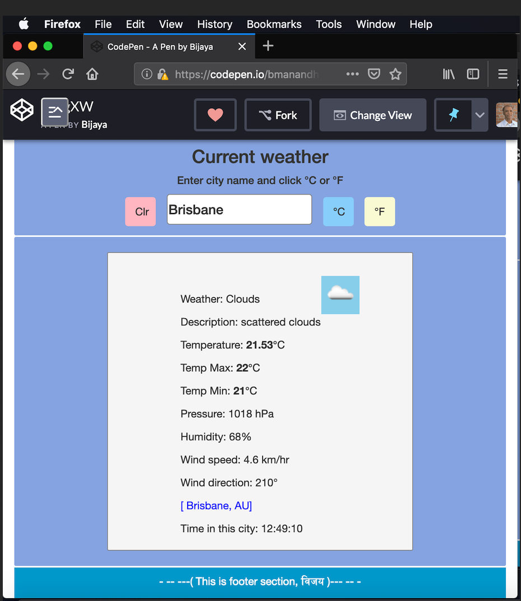

[Launch](https://codepen.io/bmanandhar/pen/qxqgXW) 
## Weather app

This is a web application that will display weather data of any city that the user wants of. It uses city name as input and pulls current weather data of the corresponding city to display for the user. 

*Technologies*

* HTML
* CSS
* JavaScript
* JQuery Library
* Bootstrap Library
* [Open Weather Map API](https://api.openweathermap.org/) 

*How it works*

The web entry point is index.html file. The HTML and CSS technologies make it possible to display a window on the screen prompting the user to enter a city name of which weather data is looked for. 

As soon as a valid city name is entered by clicking the 'Submit' button, a fuction gets triggered on the script.js file that has code base written in JavaScript using Jquery library. 

When it finds a valid city name, data will be called using AJAX get-method from the API library that has weather data in Json format.

Upon successful data call, the current weather condition of the city will get displayed on the window that has the display format that uses HTML, CSS, and Bootstrap libary. 

If the city name entered is invalid or has error, it displays error messages accordingly.

*Challenges*

* Writing jQuery function
* Function AJAX get method using the url.

### Cool!

*Screenshot Image*
* Weather

